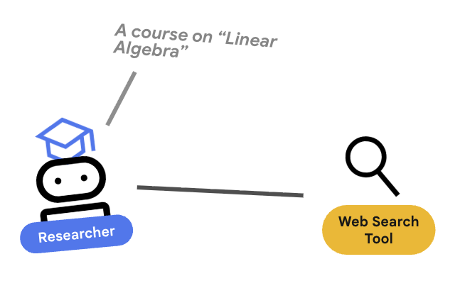

# Step 2: The Researcher Agent

<div align="center">
  <h3>
    <a href="./01_SETUP.md">⬅️ Back: Setup</a> | 
    <b>Step 2: The Researcher</b> | 
    <a href="./03_JUDGE.md">Next: The Judge ➡️</a>
  </h3>
</div>

In this step, you will build your first **Specialist Agent**. Just like a high-performing software team has different roles (Frontend, Backend, QA), a Multi-Agent System (MAS) works best when it's composed of small, focused agents with clear responsibilities.

---

## 🧠 Key Concepts: What is an Agent?

In the `@google/adk` framework, an **Agent** is more than just a prompt. It is a self-contained unit that combines:
1.  **Identity:** A name and description.
2.  **Instruction:** The "System Prompt" that defines its persona and goals.
3.  **Tools:** Capabilities that allow it to interact with the world (like Google Search OR custom functions like database/file-system calls).
4.  **State Awareness:** The ability to read from and write to a shared session memory.

### The Specialist Analogy

Think of the **Researcher** as a junior analyst. They aren't supposed to write the final blog post or judge the quality of the work; their only job is to find the best information possible using the tools provided.


---

## 🛠️ The `LlmAgent` Class

We use the `LlmAgent` class to define agents that are primarily driven by a Large Language Model (LLM). 

### 1. The Instruction Function
Instead of a static string, ADK uses an `instruction` function. This is powerful because it allows the agent to be **context-aware**. It can look at what happened in previous steps and adjust its behavior.

```typescript
instruction: (ctx) => {
    const state = ctx.invocationContext.session.state;
    // Look at previous 'judge_output' to see if we need to refine our search
    const judgeOutput = state['judge_output']; 
    
    return `You are a researcher... ${judgeOutput ? 'Refine based on: ' + judgeOutput.feedback : ''}`;
}
```

### 2. Tools: Giving the Agent "Hands"
LLMs are great at reasoning, but they are "trapped" in a box. **Tools** are the windows and doors to the outside world. By adding `GOOGLE_SEARCH` to the `tools` array, we give the agent the ability to look up real-time information.

### 3. Session State: The Shared Whiteboard
Multi-agent systems communicate via **Session State**. Think of it as a shared whiteboard where every agent can write their findings. The Researcher writes its summary to the `researcher_output` key, which the **Judge** will later read.

---

## 🚀 Implementation

Now, let's implement the Researcher. Open `apps/api/src/agents/researcher.ts` and paste the following code into the file.

### 📝 Action: Update `apps/api/src/agents/researcher.ts`

```typescript
export const researcher = new LlmAgent({
    name: 'researcher',
    model: CONFIG.DEFAULT_MODEL,
    description: 'Uses Google Search to find authoritative sources and candidate pages.',
    instruction: (ctx) => {
        log.debug('Starting researcher instruction generation');
        
        const state = ctx.invocationContext.session.state;
        const judgeOutput = state['judge_output'] as { status?: string; feedback?: string } | undefined;
        
        // Extract the user's original query
        const userContent = stringifyContent({ content: ctx.invocationContext.userContent } as any).trim();
        
        log.info('Researcher processing request', {
            userQuery: userContent.slice(0, 100),
            hasJudgeFeedback: !!judgeOutput,
        });

        // The prompt logic: persona + task + context
        const prompt = [
            'You are an expert web researcher focused on precision and credibility.',
            `The user's request is: "${userContent}".`,
            // If the judge sent us back, we include their feedback!
            judgeOutput?.feedback 
                ? `Your previous attempt did not pass quality review. Feedback to address: "${judgeOutput.feedback}".` 
                : '',
            'Use google_search to locate the most relevant, recent, and authoritative pages for this request.',
            'Aim for 3–6 cited URLs in your summary. Be factual and avoid speculation.',
            'Return your findings as a concise, structured summary.',
        ].filter(Boolean).join(' ');

        return prompt;
    },
    outputKey: 'researcher_output', // Where the results are saved in session state
    tools: [GOOGLE_SEARCH], // The tools this agent can use
});
```

---

## 🔍 Deep Dive: Why not one big prompt?
You might be wondering: *"Why not just ask one LLM to research and write the post?"*

1.  **Focus:** Smaller prompts lead to higher quality. A "Researcher" prompt only cares about facts, not tone or formatting.
2.  **Debugging:** If the research is bad, you know exactly which agent to fix.
3.  **Cost & Speed:** You can use a smaller, faster model for simple tasks and a larger one only for complex reasoning.

> **TODO: Add a diagram comparing a "Monolithic Prompt" (one giant messy box) vs. "Multi-Agent System" (clean, organized pipeline).**

---

## 🎮 Experimentation: Try these tweaks!
One of the best ways to learn how LLMs behave is to change the instructions and see what happens. Here are a few things you can try:

1.  **The Citation Count:** Change `"3–6 cited URLs"` to `"at least 10 cited URLs"`. Notice how the agent might take longer or become more detailed.
2.  **The Domain Filter:** Add a constraint like: `"Only use sources from .gov or .edu domains."` to see how it filters results.
3.  **The Persona:** Change `"expert web researcher"` to `"skeptical investigative journalist"` or `"enthusiastic tech influencer"`. How does the tone of the summary change?

---

## 🧪 Checkpoint: Test Your Agent
Before we move on to the next agent, let's make sure the Researcher actually works! We've provided a test script that runs the agent in isolation.

### 📝 Action: Run the test
Run the following command in your terminal from the `apps/api` directory:

```bash
npm run test:researcher
```

### 💡 Pro-Tip: Custom Prompts
You can also pass a custom topic directly from your terminal! Try this:

```bash
npm run test:researcher -- How does quantum computing work?
```

*(Note: The `--` is required to pass arguments through npm to the underlying script. You don't even need quotes for multi-word prompts!)*

**What happens?**
1.  The script loads your `GEMINI_API_KEY`.
2.  It invokes the `researcher` agent with your query (or a default one).
3.  The agent uses `google_search` to find facts and returns a summary.

If everything is set up correctly, you should see the research findings printed in your terminal!

---

<div align="right">
  <a href="./03_THE_JUDGE.md"><b>Next: Step 3 - The Judge ➡️</b></a>
</div>
